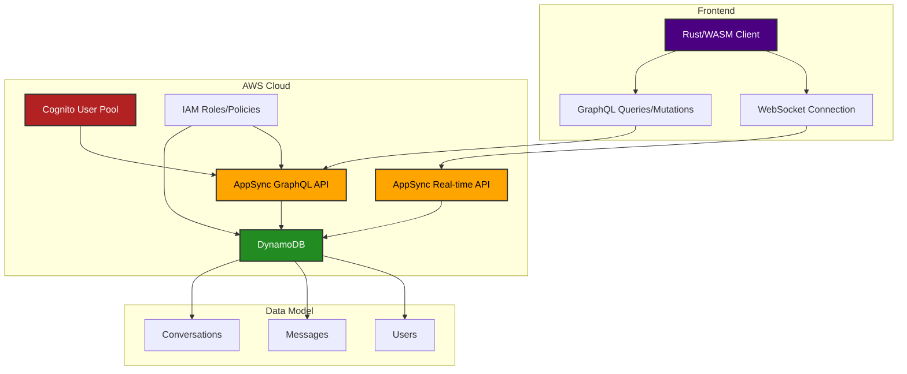

# Rusty Chat Sync

A real-time chat application built with Rust, WebAssembly, and AWS cloud services. The application provides secure authentication and real-time messaging.

## Features

- 🔐 Secure authentication with AWS Cognito
- 💬 Real-time messaging using AppSync WebSocket subscriptions
- 📱 Responsive design for mobile and desktop
- 🔄 Message synchronization and persistence
- 🌐 Scalable serverless architecture

## Architecture



## Technology Stack

- **Frontend**:

  - Rust + WebAssembly
  - Yew Framework
  - GraphQL Client
  - WebSocket for real-time updates

- **Backend**:
  - AWS AppSync (GraphQL API)
  - AWS Cognito (Authentication)
  - AWS DynamoDB (Database)
  - Terraform (Infrastructure as Code)

## Getting Started

### Prerequisites

- Rust and Cargo installed
- Node.js and npm (for development tools)
- AWS Account
- Terraform CLI

### Local Development

1. Clone the repository:

```bash
git clone https://github.com/yourusername/rusty-chat-sync.git
cd rusty-chat-sync
```

2. Install dependencies:

```bash
cargo build
```

3. Deploy AWS infrastructure:

```bash
./scripts/terraform.sh init
./scripts/terraform.sh plan   # Optional, to review changes
./scripts/terraform.sh apply
```

4. Configure the application:
   After terraform deployment, copy the outputs and update them in `src/config.rs`. The application uses hardcoded configuration values instead of environment variables due to WebAssembly and project scope limitations.

5. Run the development server:

```bash
trunk serve
```

### Deployment

The application uses Terraform for infrastructure deployment. To deploy:

1. Initialize Terraform:

```bash
./scripts/terraform.sh init
```

2. Apply the infrastructure:

```bash
./scripts/terraform.sh apply
```

## Project Structure

```
├── Cargo.toml
├── index.html
├── public
│   ├── aws.svg
│   └── styles
├── scripts
│   └── terraform.sh
├── src
│   ├── components    # Yew UI components
│   ├── graphql       # GraphQL queries and mutations
│   ├── models        # Data models
│   ├── services      # Authentication and API services
│   ├── state         # Application state management
│   ├── tests         # Unit tests
│   └── utils         # Helper utilities
└── terraform
    ├── appsync       # GraphQL schema and resolvers
    ├── dynamodb      # Database configuration
    ├── main.tf
    ├── outputs.tf
    └── variables.tf
```
