# Rusty Chat Sync 🦀

A modern real-time chat application built with Rust and AWS.

## Architecture

```mermaid
graph TB
subgraph Frontend["Frontend"]
    direction TB
    A[Rust/Yew Frontend] --> B[WebAssembly]
    B --> C[Browser]
end

subgraph AWS["AWS Cloud"]
    direction TB
    D[Amazon Cognito] --> E[AppSync API]
    E --> F[DynamoDB]
    E --> G[WebSocket API]
end

C --> D
C --> E
C --> G

%% Center alignment styling
style Frontend fill:#2D2D2D,stroke:#666
style AWS fill:#2D2D2D,stroke:#666
style A fill:#D67D20
style D fill:#E84393
style E fill:#6C5CE7
style F fill:#27AE60
style G fill:#0984E3
```



## Features

### Technical Highlights

- 🚀 **Blazing Fast**: WebAssembly-powered frontend built with Rust and Yew
- 🔒 **Secure**: JWT-based authentication with AWS Cognito
- 🔄 **Real-time**: WebSocket subscriptions via AppSync
- 🏗️ **Infrastructure as Code**: AWS infrastructure managed with Terraform

### User Features

- Real-time message synchronization across clients
- User authentication and authorization
- Message persistence

## Tech Stack

### Frontend

- 🦀 Rust + Yew for UI components
- 📦 WebAssembly for browser execution
- 🎨 CSS3 for styling

### Backend (AWS)

- 🔌 AppSync for GraphQL API
- 📡 WebSocket for real-time communications
- 🔐 Cognito for authentication
- 💾 DynamoDB for persistence

### Infrastructure

- 🏗️ Terraform for IaC

## Getting Started

### Prerequisites

- [Rust](https://www.rust-lang.org/tools/install)
- [Node.js](https://nodejs.org/) (for `wasm-pack` and bundling)
- [Terraform](https://www.terraform.io/downloads.html)
- AWS CLI configured with appropriate permissions.

## Setup

### 1. Deploy Infrastructure

Navigate to the `infrastructure` directory and initialize Terraform.

```bash
./scripts/terraform.sh init
./scripts/terraform.sh apply
```

This will provision AWS AppSync API, DynamoDB tables, and Cognito User Pools. After deployment, note the outputs such as appsync_graphql_endpoint and cognito_client_id.

### Local Development

```bash
# Clone repository
git clone https://github.com/yourusername/rusty-chat-sync
cd rusty-chat-sync

# Deploy infrastructure
./scripts/terraform.sh init
./scripts/terraform.sh apply

# Start development server
cd ..
trunk serve
```

## Project Structure

```
rusty-chat-sync/
├── src/
│   ├── components/    # Yew UI components
│   ├── graphql/       # GraphQL queries and types
│   ├── models/        # Domain models
│   ├── services/      # Business logic
│   ├── state/         # Application state
│   └── utils/         # Helper functions
├── terraform/         # Infrastructure as Code
│   ├── appsync/       # GraphQL API configuration
│   └── dynamodb/      # Database configuration
└── tests/             # Integration tests
```

## License

This project is licensed under the MIT License - see the [LICENSE](LICENSE) file for details.
